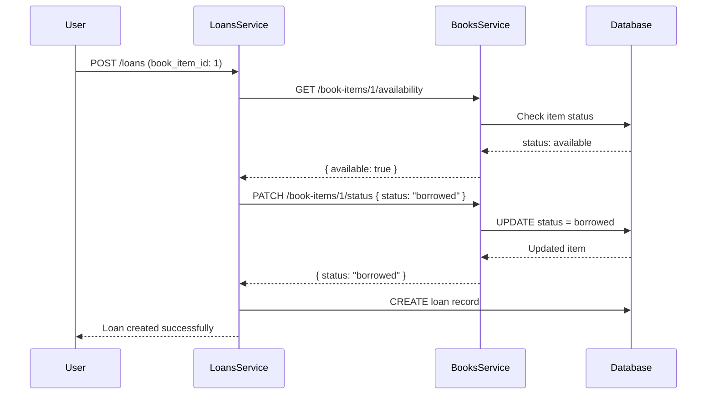

# Books Service API Documentation

## 📚 Overview

**Books Service** adalah microservice yang mengelola katalog buku dan inventaris fisik dalam ekosistem perpustakaan. Service ini bertindak sebagai **inventory authority** dan menyediakan API untuk:

- Manajemen katalog buku (CRUD)
- Manajemen item fisik buku
- Update status item untuk inter-service communication dengan **loans-service**

---

## 🏗️ Architecture

```
┌─────────────────┐         HTTP/REST        ┌──────────────────┐
│  Loans Service  │ ─────────────────────────>│  Books Service   │
│  (Orchestrator) │                           │   (Inventory)    │
└─────────────────┘                           └──────────────────┘
                                                        │
                                                        ▼
                                              ┌──────────────────┐
                                              │ PostgreSQL/      │
                                              │ Supabase         │
                                              └──────────────────┘
```

**Base URL:** `http://localhost:3000/api`

---

## 🔐 Authentication

Service ini menggunakan **stateless JWT authentication**:

### JWT Payload Structure
```json
{
  "user_id": 101,
  "role": "mahasiswa" | "admin",
  "iat": 1234567890,
  "exp": 1234567890
}
```

### Headers
```
Authorization: Bearer <JWT_TOKEN>
```

### Role-Based Access
- **Public** - Tanpa autentikasi
- **Student** (`mahasiswa`) - JWT valid
- **Admin** (`admin`) - JWT valid dengan role admin

---

## 📖 API Endpoints

### **Books Module** (Catalog Management)

#### 1. GET /api/books
**Daftar semua buku**

- **Access:** Public
- **Response:**
```json
[
  {
    "id": "1",
    "isbn": "978-0439708180",
    "title": "Harry Potter and the Sorcerer's Stone",
    "author": "J.K. Rowling",
    "publisher": "Scholastic",
    "category": "Fantasy",
    "publication_year": 1998,
    "cover_url": "https://example.com/cover.jpg",
    "created_at": "2025-01-01T00:00:00.000Z",
    "updated_at": "2025-01-01T00:00:00.000Z"
  }
]
```

---

#### 2. GET /api/books/stats
**Statistik buku dan item**

- **Access:** Public
- **Response:**
```json
{
  "total_books": 150,
  "total_items": 500,
  "available_items": 380,
  "borrowed_items": 100
}
```

---

#### 3. GET /api/books/:id
**Detail buku dengan semua item fisiknya**

- **Access:** Public
- **Response:**
```json
{
  "id": "1",
  "isbn": "978-0439708180",
  "title": "Harry Potter and the Sorcerer's Stone",
  "author": "J.K. Rowling",
  "publisher": "Scholastic",
  "category": "Fantasy",
  "publication_year": 1998,
  "cover_url": "https://example.com/cover.jpg",
  "created_at": "2025-01-01T00:00:00.000Z",
  "updated_at": "2025-01-01T00:00:00.000Z",
  "items": [
    {
      "id": "1",
      "inventory_code": "BK-HP-001",
      "status": "available",
      "rack_location": "A1-01"
    },
    {
      "id": "2",
      "inventory_code": "BK-HP-002",
      "status": "borrowed",
      "rack_location": "A1-02"
    }
  ]
}
```

---

#### 4. POST /api/books
**Tambah buku baru ke katalog**

- **Access:** Admin only
- **Headers:** `Authorization: Bearer <TOKEN>`
- **Body:**
```json
{
  "isbn": "978-0439708180",
  "title": "Harry Potter and the Sorcerer's Stone",
  "author": "J.K. Rowling",
  "publisher": "Scholastic",
  "category": "Fantasy",
  "publication_year": 1998,
  "cover_url": "https://example.com/cover.jpg"
}
```
- **Response:** `201 Created`

---

#### 5. PATCH /api/books/:id
**Update informasi buku**

- **Access:** Admin only
- **Headers:** `Authorization: Bearer <TOKEN>`
- **Body:** (semua field optional, kirim hanya yang ingin diubah)
```json
{
  "title": "Harry Potter and the Philosopher's Stone",
  "publication_year": 1997,
  "cover_url": "https://example.com/new-cover.jpg"
}
```
- **Response:**
```json
{
  "id": "1",
  "isbn": "978-0439708180",
  "title": "Harry Potter and the Philosopher's Stone",
  "author": "J.K. Rowling",
  "publisher": "Scholastic",
  "category": "Fantasy",
  "publication_year": 1997,
  "cover_url": "https://example.com/new-cover.jpg",
  "created_at": "2025-01-01T00:00:00.000Z",
  "updated_at": "2025-01-15T10:30:00.000Z"
}
```
- **Error:** 
  - `404` - Buku tidak ditemukan
  - `409` - ISBN sudah digunakan buku lain (jika mengubah ISBN)

---

#### 6. DELETE /api/books/:id
**Hapus buku dari katalog**

- **Access:** Admin only
- **Headers:** `Authorization: Bearer <TOKEN>`
- **Response:**
```json
{
  "message": "Buku \"Harry Potter\" berhasil dihapus"
}
```
- **Error:** Gagal jika ada item yang sedang dipinjam

---

### **Book Items Module** (Inventory Management)

#### 7. GET /api/book-items/:id
**Detail item fisik buku**

- **Access:** Public
- **Response:**
```json
{
  "id": "1",
  "book_id": "1",
  "inventory_code": "BK-HP-001",
  "status": "available",
  "rack_location": "A1-01",
  "created_at": "2025-01-01T00:00:00.000Z",
  "book": {
    "id": "1",
    "title": "Harry Potter and the Sorcerer's Stone",
    "author": "J.K. Rowling",
    "isbn": "978-0439708180"
  }
}
```

---

#### 8. GET /api/book-items/:id/availability
**Cek ketersediaan item**

- **Access:** Public (digunakan oleh loans-service)
- **Response:**
```json
{
  "available": true,
  "status": "available",
  "message": "Item tersedia untuk dipinjam"
}
```

---

#### 9. GET /api/book-items/by-book/:bookId
**Daftar semua item untuk buku tertentu**

- **Access:** Public
- **Response:** Array of BookItem

---

#### 10. POST /api/book-items
**Tambah item fisik baru**

- **Access:** Admin only
- **Headers:** `Authorization: Bearer <TOKEN>`
- **Body:**
```json
{
  "book_id": 1,
  "inventory_code": "BK-HP-003",
  "status": "available",
  "rack_location": "A1-03"
}
```
- **Response:** `201 Created`

---

#### 11. PATCH /api/book-items/:id/status ⚠️ **CRITICAL**
**Update status item (untuk inter-service communication)**

- **Access:** Admin OR valid JWT (system-to-system)
- **Headers:** `Authorization: Bearer <TOKEN>`
- **Body:**
```json
{
  "status": "borrowed"
}
```

**Status Enum Values:**
- `available` - Item tersedia
- `borrowed` - Item sedang dipinjam
- `lost` - Item hilang
- `repair` - Item sedang diperbaiki

**Response:**
```json
{
  "id": "1",
  "book_id": "1",
  "inventory_code": "BK-HP-001",
  "status": "borrowed",
  "rack_location": "A1-01",
  "created_at": "2025-01-01T00:00:00.000Z",
  "book": {
    "id": "1",
    "title": "Harry Potter and the Sorcerer's Stone",
    "author": "J.K. Rowling",
    "isbn": "978-0439708180"
  }
}
```

**Business Logic:**
- ✅ `available` → `borrowed` (Peminjaman)
- ✅ `borrowed` → `available` (Pengembalian)
- ❌ `borrowed` → `borrowed` (Error: Sudah dipinjam)
- ❌ `lost`/`repair` → `borrowed` (Error: Item tidak dapat dipinjam)

---

## 🔧 Error Responses

### 400 Bad Request
```json
{
  "statusCode": 400,
  "message": ["title must be a string", "author must be a string"],
  "error": "Bad Request"
}
```

### 401 Unauthorized
```json
{
  "statusCode": 401,
  "message": "Token tidak valid",
  "error": "Unauthorized"
}
```

### 403 Forbidden
```json
{
  "statusCode": 403,
  "message": "Akses ditolak. Memerlukan role: admin",
  "error": "Forbidden"
}
```

### 404 Not Found
```json
{
  "statusCode": 404,
  "message": "Buku dengan ID 999 tidak ditemukan",
  "error": "Not Found"
}
```

### 409 Conflict
```json
{
  "statusCode": 409,
  "message": "Item sudah dalam status borrowed. Tidak dapat dipinjam lagi",
  "error": "Conflict"
}
```

---

## 🔄 Inter-Service Communication Flow

### Scenario: User Meminjam Buku



---

## 🚀 Getting Started

### 1. Install Dependencies
```bash
npm install
```

### 2. Setup Environment
Edit `.env`:
```env
DATABASE_URL="postgresql://..."
DIRECT_URL="postgresql://..."
PORT=3000
JWT_SECRET=your-super-secret-jwt-key-change-this-in-production
NODE_ENV=development
```

### 3. Generate Prisma Client
```bash
npx prisma generate
```

### 4. Run Database Migration
```bash
npx prisma db push
```

### 5. Start Server
```bash
npm run start:dev
```

Server akan berjalan di: `http://localhost:3000/api`

---

## 🧪 Testing dengan cURL

### Get All Books (Public)
```bash
curl http://localhost:3000/api/books
```

### Create Book (Admin)
```bash
curl -X POST http://localhost:3000/api/books \
  -H "Authorization: Bearer YOUR_JWT_TOKEN" \
  -H "Content-Type: application/json" \
  -d '{
    "title": "The Hobbit",
    "author": "J.R.R. Tolkien",
    "isbn": "978-0547928227"
  }'
```

### Update Book (Admin)
```bash
curl -X PATCH http://localhost:3000/api/books/1 \
  -H "Authorization: Bearer YOUR_JWT_TOKEN" \
  -H "Content-Type: application/json" \
  -d '{
    "title": "The Hobbit - Special Edition",
    "publication_year": 2020
  }'
```

### Update Item Status (System)
```bash
curl -X PATCH http://localhost:3000/api/book-items/1/status \
  -H "Authorization: Bearer YOUR_JWT_TOKEN" \
  -H "Content-Type: application/json" \
  -d '{
    "status": "borrowed"
  }'
```

---

## 📝 Notes for Developers

### Critical Considerations

1. **Status Update Endpoint** adalah yang paling penting untuk inter-service communication
2. Pastikan JWT_SECRET **sama** antara books-service dan loans-service
3. Gunakan transaction jika melakukan multiple database operations
4. Validasi status transitions untuk mencegah data inconsistency
5. Log semua inter-service calls untuk debugging

### Security Best Practices

- ❌ **JANGAN** hardcode JWT_SECRET di code
- ✅ Gunakan environment variables
- ✅ Rotate JWT_SECRET secara berkala di production
- ✅ Implement rate limiting untuk API endpoints
- ✅ Validate input dengan class-validator

---

## 📚 Tech Stack

- **Framework:** NestJS
- **ORM:** Prisma
- **Database:** PostgreSQL (Supabase)
- **Validation:** class-validator, class-transformer
- **Authentication:** jsonwebtoken
- **Language:** TypeScript

---

**Developed with ❤️ for Library Microservices Ecosystem**
